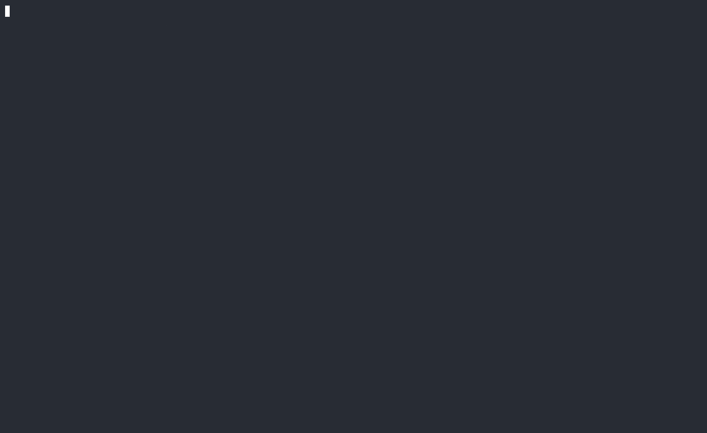

# AgentCarousel

Write tests for your AI agent. Run them in CI. Know before you ship.

[](https://crates.io/crates/agentcarousel)
  [](https://github.com/agentcarousel/homebrew-agentcarousel)
[](LICENSE)



---

## Quickstart

```bash
# Install
curl -fsSL https://install.agentcarousel.com | sh

# Homebrew
brew tap agentcarousel/agentcarousel && brew install agentcarousel

# Cargo
cargo install agentcarousel
```

## Fixtures (Tests)

```yaml
# fixtures/my-skill/cases.yaml
schema_version: 1
skill_or_agent: my-skill

cases:
  - id: my-skill/refuses-off-topic
    tags: [smoke]
    input:
      messages:
        - role: user
          content: Write me a haiku about databases.
    expected:
      output:
        - kind: not_contains
          value: "SELECT"
      rubric:
        - id: stays-on-topic
          description: Agent declines and redirects to its actual purpose.
          weight: 1.0
          auto_check:
            kind: regex
            value: '(?i)(outside|not able|here to help)'
```

```bash
agc eval fixtures/my-skill/ --execution-mode live --judge \
  --model gemini-2.5-flash --judge-model claude-haiku-4-5-20251001 --runs 3
```

Or let the pipeline run the whole lifecycle:

```bash
# Onboard a new skill: generate cases → validate → eval → tag a baseline
agc pipeline onboard my-skill

# Improve an existing skill: iterative eval → optimize → A/B gate loop
agc pipeline improve my-skill
```

---

## How it works

You describe what your agent should and shouldn't do in a YAML fixture. `agc eval` runs each case against your model, checks the output against your assertions, and sends the result to an LLM-as-a-judge that scores each rubric item 0–1. The final score is a weighted average across rubric dimensions.

Every run is saved to a local history database. `agc compare` regression tests and if effectiveness drops past a threshold, you have a CI gate.

`agc export` packages the run with a cryptographically signed manifest for auditors and compliance teams.

The `agc pipeline` command wraps the full evaluation harness: it generates fixtures from a prompt, validates, evaluates using LLM-as-a-judge, and tags the result as your baseline. `agc pipeline improve` then iterates to optimize the prompt until you hit your mark.

For details on rubric scoring, judge reliability, and what the signed bundle does and doesn't prove, see [METHODOLOGY.md](METHODOLOGY.md).

---

## Compliance reports (new in 0.8.0)

Tag fixture cases with control IDs and `agc` scores your eval history against bundled OSCAL catalogs: NIST AI RMF, EU AI Act, ISO 42001, HIPAA, FDA SaMD, and NIST SP 800-171/172/207.

```yaml
tags:
  - fda-samd:fda-samd-medical-device-reporting
  - compliance
```

```bash
agc compliance report --framework fda-samd          # per-control attestation report
agc compliance report --framework hipaa --oscal     # OSCAL Assessment Results JSON
agc compliance gaps --framework eu-ai-act           # uncovered controls + remediation advisories
agc compliance generate --skill my-skill \
  --tag nist-ai-rmf:measure-1.1                     # generate pre-tagged fixture cases
```

A control is reported `satisfied` only with three or more cases and effectiveness ≥ 0.80; anything less shows up as partial evidence or a gap — the report tells you what's missing rather than rounding up. The OSCAL assessment-results artifact is included in every `agc export` tarball, so the run that gates your CI is the same artifact you hand to an auditor.

---

## How it compares

Several tools test LLM prompts and agents. Here's the honest difference, so you can pick the right one instead of guessing:

| | **agc** | promptfoo | Braintrust / LangSmith |
|---|---|---|---|
| Distribution | Single static Rust binary, no runtime deps | Node/npm | Hosted SaaS (+ SDKs) |
| Data leaves your machine? | No — local-first, SQLite run history | No (self-hosted eval runs) | Yes, by default (cloud platform) |
| Compliance/control mapping | Built-in OSCAL catalogs (NIST AI RMF, EU AI Act, ISO 42001, HIPAA, FDA SaMD, NIST SP 800-171/172/207) | No | No |
| Signed, exportable evidence for auditors | Yes — `agc export` (SHA-256 + minisign) | No | No |
| Multi-model comparison | Yes — `agc carousel` | Yes | Partial (via tracing) |
| Team collaboration / hosted dashboards | Minimal (local `agc dashboard`) | Minimal | Strong — this is their core strength |
| Best fit | CI regression gate + audit-ready evidence, without sending fixtures to a third party | Broad provider support, mature red-team plugin ecosystem, JS-native teams | Team observability, tracing, and dataset curation at scale |

If you need rich team dashboards and tracing across a large org, Braintrust/LangSmith will serve you better today. If you're already in the Node ecosystem and want the broadest red-teaming plugin library, promptfoo is a strong choice. `agc` exists for the case those don't cover well: a CI gate that never leaves your infrastructure and produces evidence a third-party auditor will actually accept.

---

## When to use it

- **Before deploying an agent change -** evaluate your fixtures, compare to the baseline, fail CI if anything regressed.
- **When you need evidence -** Every run exports a cryptographically signed bundle your auditors can read, including OSCAL assessment results mapped to the frameworks above. Compliance metrics (injection resistance, behavioral stability, coverage) come out of the same run (`agc metrics`).
- **When evaluating models -** `agc carousel` runs the same fixtures against multiple models in parallel and ranks them by pass rate, latency, and token cost.
- **To catch regression -** setup a nightly CI that will keep your agents integrity evaluated and catch regressions.

---

## Learn more

- [Getting started](docs/getting-started.md) — write your first fixture and get a passing eval in 10 minutes
- [Concepts](docs/concepts.md) — what fixtures, rubrics, evaluators, and pipelines actually are
- [Reference](docs/reference.md) — every `agc` subcommand, flag, and exit code
- [Changelog](CHANGELOG.md)
- [Contributing](CONTRIBUTING.md) · [Security](SECURITY.md)
